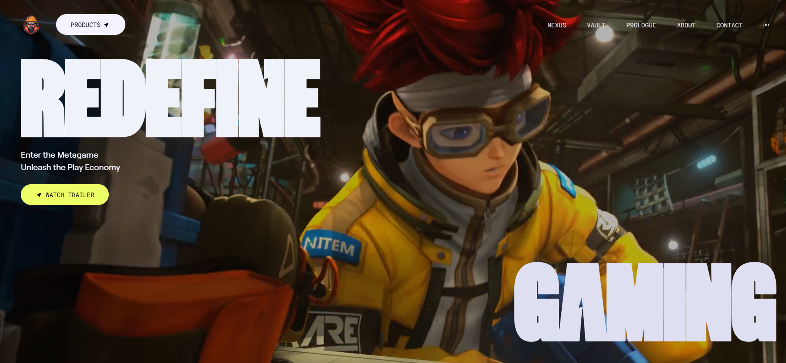

# 🌐 Modern Animated Website

A sleek, responsive animated website built using **React**, **GSAP**, and **Tailwind CSS**. This project showcases a modern design with smooth scroll-based animations and interactive UI elements – perfect for portfolios, landing pages, or startup websites.

-----

## 🔗 Live Demo

👉 [Website Link](https://notmodern.vercel.app)

-----

## 📸 Preview



-----

## 📌 Table of Contents

- [✨ Features](#-features)
- [⚙️ Tech Stack](#-tech-stack)
- [📦 Installation](#-installation)
- [📌 Usage](#-usage)
- [📂 Folder Structure](#-folder-structure)
- [🚀 Future Improvements](#-future-improvements)
- [🤝 Contributing](#-contributing)
- [📞 Contact](#-contact)

-----

## ✨ Features

  - 🚀 Smooth animations with [GSAP](https://greensock.com/gsap/)
  - 💻 Fully responsive design (mobile & desktop)
  - ⚛️ Component-based structure with React
  - 🎨 Custom styling with Tailwind CSS
  - 🎥 Scroll-based transitions and effects

-----

## ⚙️ Tech Stack

| Frontend | Styling      | Animations |
| :------- | :----------- | :--------- |
| React    | Tailwind CSS | GSAP       |

-----

## 📦 Installation

1.  **Clone the repository**
    ```bash
    git clone https://github.com/CoderGuyShubham/Modern-Animated-Website.git
    cd Modern-Animated-Website
    ```
2.  **Install dependencies**
    ```bash
    npm install
    ```
3.  **Run the development server**
    ```bash
    npm run dev
    ```

-----

## 📌 Usage

This project is perfect for:

  * Personal portfolios
  * Landing pages
  * Startup or SaaS websites
  * Learning GSAP + Tailwind integration

Customize the sections in `src/components/` to match your brand or use case. Update text, colors, and animations as needed.

-----

## 📂 Folder Structure

```bash
Modern-Animated-Website/
├── public/                # Static assets
├── src/
│   ├── components/        # React components (Navbar, Hero, etc.)
│   ├── App.jsx            # Main app entry
│   └── main.jsx           # Vite entry point
├── index.html
├── package.json
└── README.md
```

-----

## 🚀 Future Improvements

  - 🌙 Dark mode support
  - 🌍 Multi-language support
  - 🧪 Unit testing with Vitest or Jest
  - 💡 Better accessibility (ARIA roles, keyboard navigation)
  - 🔧 CMS integration (e.g., Sanity, Strapi)

-----

## 🤝 Contributing

1.  Fork this repository.
2.  Create a new branch: `git checkout -b feature/your-feature`
3.  Commit your changes: `git commit -m 'Add new feature'`
4.  Push to your branch: `git push origin feature/your-feature`
5.  Open a pull request.

-----

## 📞 Contact

Built by Shubham Singh – **@CoderGuyShubham**

For collaboration or feedback, open an issue or drop a message on GitHub.

If you like this project, consider ⭐ starring it\!